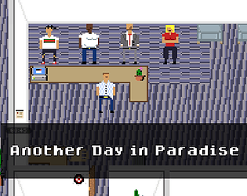

## Another Day In Paradise

A game made in Godot with my friend [Kieran](https://www.linkedin.com/in/kieran-lewis-738837106/).

<!--truncate-->

### Link to project
[Itch.io ↗ ](https://hexatin.itch.io/another-day-in-paradise)

## About The Project

This game was a somewhat apathetic look at working in IT. My junior year of high school I worked at the local community college over the summer at the IT helpdesk as a tech for minimum wage. I answered phones, wrote tickets, went to help customers, manually updated laptops, wrote tickets, got yelled at, drank coffee, and wrote tickets. Overall I wasn't super fond of working in helpdesk, and the whole idea of this game was to poke fun at the rough parts of working IT and try to make it fun.

Making this game was a joint effort between myself, my friend Kieran, and my friend Cian. Kieran led the development, I led the artwork, and Cian recorded the sounds and music. Between the three of us we had a week to complete the game for the game jam, but given some scheduling conflicts we really only had the first weekend for the most part. Because of this we had to **hurry**. As a result it wasn't as polished as we would've liked it, but it was an incredibly fun experience full of new things learned.

This project was full of a lot of firsts, first time making a game, first time using Godot, first time writing GDScript, first time using Pixelorama, and first time making sprites for a game. It was incredibly challenging cramming everything into the span of about 3 days over a weekend, but if I could go back to do it over again I wouldn't change a thing. 

## Technology Used

- Godot 3
- Pixelorama 
- Audacity
- Ableton Live
- Gitlab
- VS Code

 
