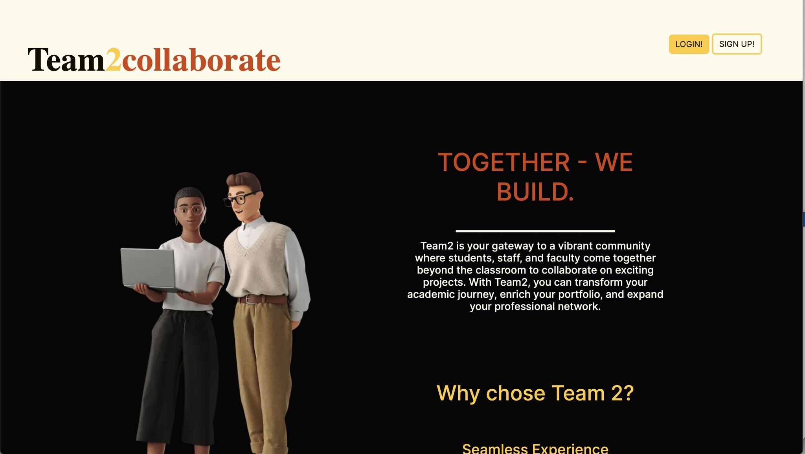
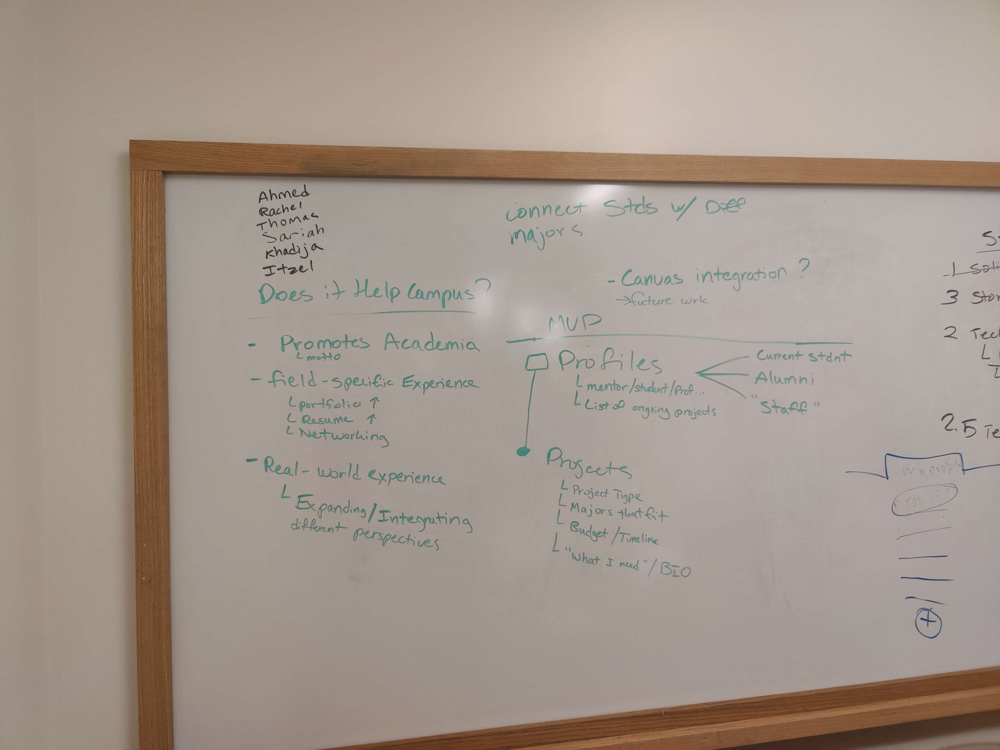
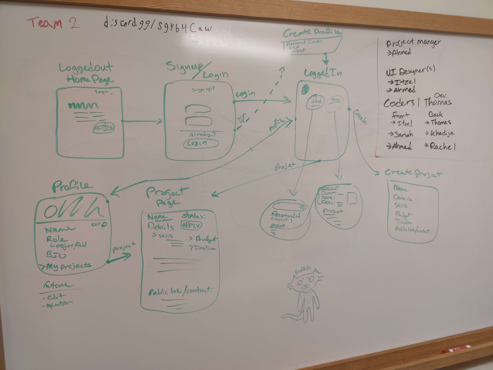
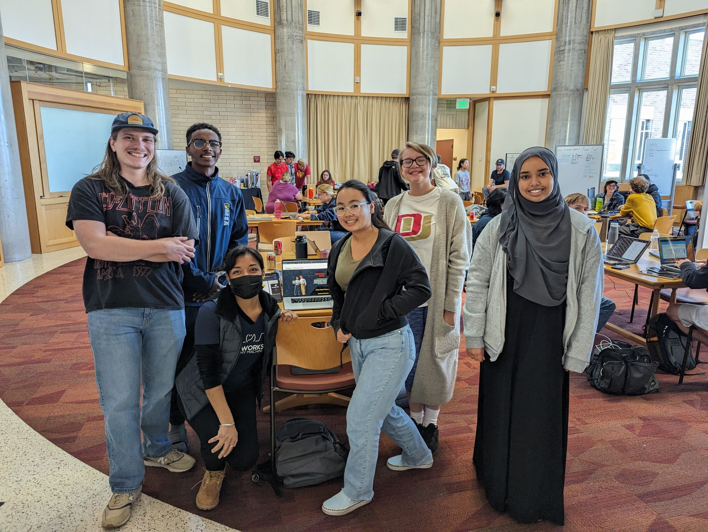

## Team2

A hackathon project that got podium!

  

<!--truncate-->

### Link to project
[Project ↗ ](https://github.com/ThomasD0213/teamtwo)

## About The Project

This project was the result of 2 days work by 6 undergraduate students, including myself, from MSU Denver and DU. I had never met any of the others except for one beforehand. Once we started we quickly got to brainstorming, and decided on a topic we'd like to cover. The topic we wanted to work on was sort of like a social media for students to find help from other students from other majors, tutors, and professors. A bulletin board for students to connect with each other if you will. 

  

Once we figured out what we wanted to do, we organized into different roles, of which I lead the development effort. The first third of the day we spent just brainstorming, the second third was just learning Next.js since none of us had used it before, and the final third of day one was really locking in and getting stuff done.

  

The second day was filled with patching up bugs and finishing touches. Having whiteboard tables helped us stay organized.

  

Overall in the end we managed to get 3rd place. Considering none of us knew each other, none of us had used the technology, and we had less than 48 hours to complete the work, I'd say we did a pretty stellar job.

 

## Technology Used

- Next.js
- Python Flask
- SQLite
- Github
- VS Code 

